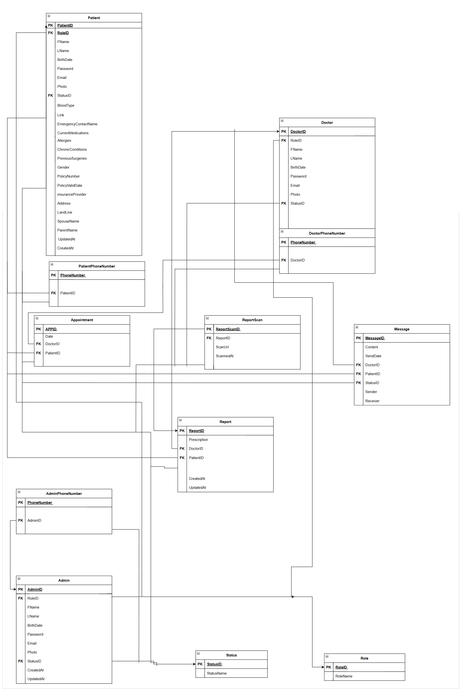

<h1 align="center">
   
  
   
  Cardiology WTever
   
</h1>

# 🫀Cardiology Hospital Information System 
Welcome to the Cardiology Hospital Information System (HIS) – your gateway to modern, efficient, and patient-centered heart care management.

---

### 🚀 **Live Demo**

👉 [Explore the Live System](https://cardio-w-tever.vercel.app/)

---

  
### 🔸 ER Model  

---

### 🔸 Relational Schema  

## 📌 Project Overview
This web application serves as a **Cardiology Department Information System**, aiming to enhance healthcare operations through digital transformation. In **Phase 1**, we focused on building the foundational features, including authentication, registration, and patient profile management with a responsive user interface.

---

## ✅  Implemented Features

### 🔹1. User Interface Pages
- **Homepage**: Welcoming interface with department overview and navigation options
- **Login Page**:Role-based secure login for patients, doctors, and admins 
- **Registration Page**: Multi-step form for new patient accounts
- **Profile Page**: Detailed view of patient information with edit capabilities

### 🔹2. Core Functionalities
- **User Authentication System**
  - Role-based login (Patient/Doctor/Admin)
  - Secure password handling
- **Patient Profile Management**
  - Personal information section
  - Medical history tracking
  - Contact details management
  - Family and emergency contact information
- **Responsive Design**
  - Mobile-friendly layouts
  - Consistent styling across pages

---
## 💻 Technical Implementation

### Frontend
- HTML5/CSS3 for page structure and styling
- Bootstrap framework for responsive design
- JavaScript for interactive elements
- Form validation for data integrity

### Backend 
- Custom **ER model** and **Relational Schema** tailored to cardiology data requirements 
- User authentication system planned
- API endpoints outlined for future development
---

## 🖼️ Our Web  

### 🔸 Homepage  

---

### 🔸 Login Page  

---

### 🔸 Registration Process  
**Step 1 – Personal Information**  

**Step 2 – Account Information**  

**Step 3 – Contact Information**  

---

### 🔸 Patient Profile  

---

## 🔧 Backend Architecture

### Technology Stack
- **.NET Framework**: Robust backend logic and API development
- **JWT Authentication**: Secure token-based authentication system
- **Neon PostgreSQL**: Cloud-native, scalable database solution
- **RESTful API**: Comprehensive endpoints for all system operations

### Security Features
- **Role-Based Access Control**: Separate authentication for Patients, Doctors, and Admins
- **Password Complexity Requirements**: Enforced strong password policies
- **JWT Token Authorization**: Secure API access with Bearer tokens
- **Data Validation**: Comprehensive input validation and sanitization

### Database Design
- Custom **ER model** tailored for cardiology department operations
- **Relational Schema** optimized for healthcare data management
- Support for patient medical records, appointment scheduling, and communication

---

## 📚 API Documentation

### Base Configuration
- **Base URL**: `/api`
- **Authentication**: Bearer Token (JWT)
- **Content Types**: `application/json`, `multipart/form-data`

### User Role Categories

#### 🔴 Admin Operations
Complete system administration capabilities including user management, profile oversight, and system configuration.

#### 🔵 Doctor Operations  
Medical staff functionalities including patient management, appointment handling, profile updates, and communication tools.

#### 🟢 Patient Operations
Patient-centered services including registration, profile management, appointment booking, and medical record access.

#### 🟡 Message System
Secure communication platform between doctors and patients with full conversation history and message management.

#### 🗓️ Appointment Management
Comprehensive appointment system supporting booking, rescheduling, cancellation, and status tracking.

---

## 🔗 Core API Endpoints

### Authentication & Profile Management

| HTTP Method | Endpoint | Description | Access Level |
|-------------|----------|-------------|--------------|
| POST | `/api/Patient/Login` | Patient authentication | Patient |
| POST | `/api/Doctor/Login` | Doctor authentication | Doctor |
| POST | `/api/Admin/Login` | Admin authentication | Admin |
| POST | `/api/Patient/Register` | New patient registration | Patient/Admin |
| GET | `/api/Patient/Profile` | Retrieve patient profile | All Authenticated |
| PUT | `/api/Patient/UpdateProfile` | Update patient information | Patient |
| GET | `/api/Doctor/Profile` | Retrieve doctor profile | All Authenticated |
| PUT | `/api/Doctor/UpdateProfile` | Update doctor information | Doctor |
| POST | `/api/Doctor/CreateDoctor` | Create new doctor account | Admin |

### Appointment System

| HTTP Method | Endpoint | Description | Access Level |
|-------------|----------|-------------|--------------|
| POST | `/api/Appointment/BookAppointment` | Schedule new appointment | Patient |
| GET | `/api/Appointment/GetAppointments` | Retrieve appointments by date | All Authenticated |
| GET | `/api/Appointment/GetAppointment` | Get specific appointment | All Authenticated |
| POST | `/api/Appointment/RescheduleAppointment` | Modify appointment time | Patient |
| POST | `/api/Appointment/CancelAppointment` | Cancel existing appointment | Patient |
| POST | `/api/Appointment/MarkAppointment` | Mark as completed/missed | Doctor |

### Communication System

| HTTP Method | Endpoint | Description | Access Level |
|-------------|----------|-------------|--------------|
| GET | `/api/Message/GetMessages` | Retrieve conversation history | Patient/Doctor |
| POST | `/api/Message/SendMessage` | Send message to user | Patient/Doctor |
| DELETE | `/api/Message/Delete` | Remove specific message | Message Owner |

### Medical Report System

| HTTP Method | Endpoint | Description | Access Level |
|-------------|----------|-------------|--------------|
| POST | `/api/Report/CreateReport` | Create new medical report | Doctor |
| POST | `/api/Report/UpdateReport` | Update existing report | Doctor |
| GET | `/api/Report/GetReport` | Retrieve report by appointment ID | All Authenticated |

### Administrative Functions

| HTTP Method | Endpoint | Description | Access Level |
|-------------|----------|-------------|--------------|
| GET | `/api/Admin/AdminProfilesList` | List all admin profiles | Admin |
| GET | `/api/Doctor/DoctorProfilesList` | List all doctor profiles | All Authenticated |
| GET | `/api/Patient/PatientProfilesList` | List all patient profiles | Admin/Doctor |
| POST | `/api/Admin/CreateAdmin` | Create new admin account | Admin |
| DELETE | `/api/Admin/Delete` | Remove admin account | Admin |

---

## 🔒 Security & Validation

### Password Requirements
- **Length**: 8-100 characters
- **Complexity**: Must include lowercase, uppercase, digit, and special character
- **Pattern**: `^(?=.*[a-z])(?=.*[A-Z])(?=.*\d)(?=.*[^\da-zA-Z]).{8,}$`

### Data Validation Rules
- **Email Format**: Standard email validation with 100 character limit
- **Phone Numbers**: Egyptian mobile format (`^(?:\+20|0)?1[0125]\d{8}$`)
- **Names**: 2-50 character limit with pattern validation
- **Medical Data**: Structured formats for blood types, allergies, medications
- **Appointment Constraints**: Future dates only, no time slot conflicts

### Role-Based Security
- **Patient Access**: Profile management, appointment booking, messaging
- **Doctor Access**: Patient lists, appointment management, medical records, messaging
- **Admin Access**: Full system administration, user management, reporting

---

## 📊 System Capabilities

### Patient Management
- Comprehensive registration with medical history
- Profile updates with photo upload support
- Emergency contact and family information
- Insurance policy management
- Medical record tracking (allergies, medications, surgeries)

### Appointment System
- Real-time availability checking
- Multi-status tracking (Confirmed, Cancelled, Postponed, Completed, Missed)
- Automated conflict prevention
- Rescheduling and cancellation workflows

### Communication Platform
- Secure doctor-patient messaging
- Message history preservation
- File attachment support 
- Real-time notification system 

### Medical Report System
- Doctor-created medical reports linked to appointments
- Report creation and update functionality
- Appointment-based report retrieval
- Secure access control for sensitive medical data

### Administrative Tools
- User role management
- Profile oversight and editing
- System-wide search functionality
- Pagination for large datasets
- Comprehensive audit trails

---

### 👥 Team Members

| Name                        |
|-----------------------------|
| Alhussien Ayman Hanafy      |
| Ahmed Loay Elsayyed         |
| Suhila Tharwat Elmasry      |
| Mai Mahmoud Mohamed         |
| Muhammad Khaled Abdalhameed |